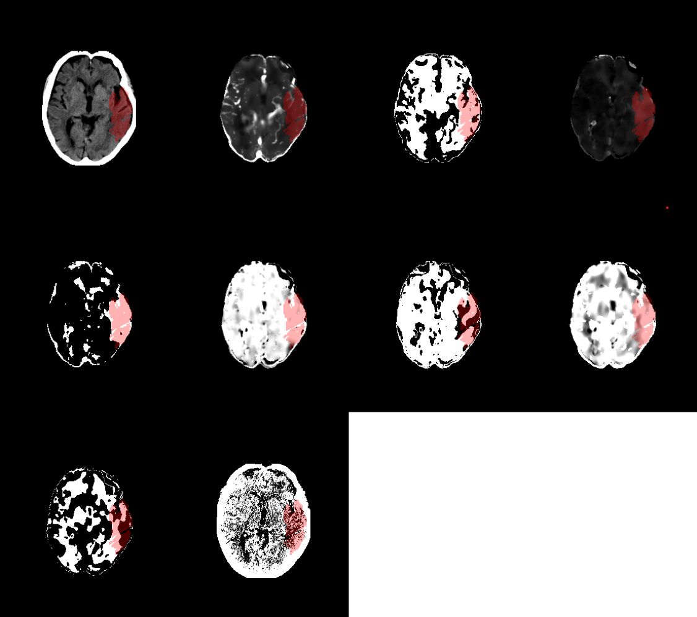

# 3D Scan Slice Preprocessing Visualization

A Python tool for visualizing multi-modal medical imaging data, particularly focused on stroke imaging modalities like NCCT, CTA, CBF, CBV, MTT, and TMAX.

<div align="center">
  
  <p><em>Example visualization showing different modalities and processing configurations</em></p>
</div>

## Features

- Support for multiple imaging modalities
- Customizable visualization parameters
- Segmentation mask overlay support
- Multiple slice visualization
- Different orientation views (axial, sagittal, coronal)

## Installation

1. Clone the repository:
```bash
git clone https://github.com/yourusername/3D_scan_visualization.git
cd 3D_scan_visualization
```

2. Install dependencies:
```bash
pip install -r requirements.txt
```

## Usage

Basic usage example:
```bash
python main.py --case_id CASE001 --modalities NCCT_white,NCCT_gray --slices 80,85
```

### Command Line Arguments

- `--data_dir`: Dataset directory (default: "../isles24_combined/")
- `--json_list`: Dataset JSON file path
- `--case_id`: Case ID to visualize (required)
- `--modalities`: Comma-separated list of modality configurations
- `--slices`: Slice selection (single number or 'min,max' range)
- `--show_segmentation_mask`: Flag to overlay segmentation mask
- `--orientation`: Slice orientation (axial/sagittal/coronal)

## Project Structure

```
3D_scan_visualization/
├── src/
│   ├── data/           # Data loading and transformation
│   ├── processing/     # Modality-specific processing
│   ├── visualization/  # Plotting and visualization
│   └── utils/         # Utility functions
├── tests/             # Test files
├── examples/          # Example usage
├── requirements.txt   # Dependencies
└── main.py           # Main entry point
```

## Supported Modalities

- NCCT (Non-contrast CT)
  - White matter window
  - Gray matter window
  - Combined white/gray matter window
- CTA (CT Angiography)
  - Arterial phase
  - Venous phase
- CBF (Cerebral Blood Flow)
- CBV (Cerebral Blood Volume)
- MTT (Mean Transit Time)
- TMAX (Time to Maximum)
